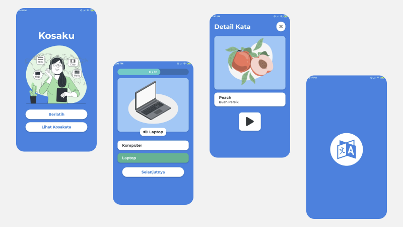

# Kosaku
Aplikasi sederhana tentang pembelajaran kosakata dasar bahasa Inggris. Aplikasi ini terdiri dari Quiz dan Kamus Mini. Fitur utama dari aplikasi ini adalah gambar ilustrasi dari setiap kata dan Text-To-Speech.

[Demo Video](https://drive.google.com/file/d/1h6bVyDzywu6k2_v8cu-asRrx04urGfQp/view?usp=sharing)

## Aplikasi
[Download](https://drive.google.com/file/d/1L8Ty4gnmFxeJMlDolV4rXpXcNGJ4FaWE/view?usp=sharing)

## Desain
[Figma](https://www.figma.com/file/TEcdLQAqZCdNi1pzbq4tKi/Kosaku?node-id=0%3A1)

## Setup
```sh
yarn upgrade
yarn install
```

## Assets
[Image-Illustration by Storyset](https://storyset.com/)

## Screenshot

