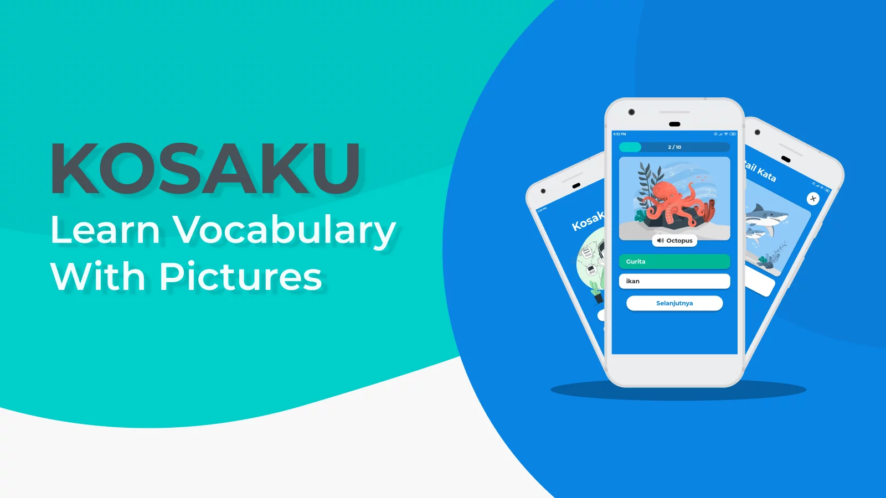

## About Project


Applications about learning basic English vocabulary. The main feature of this app is the illustration of vocabulary and text-to-speech.

The illustration image is from the [storyset](https://storyset.com/).

### JSON Firestore Structure

```JSON
{
  "Dictionary": [
    {
      "id": "",
      "data": {
        "image": "",
        "mainCategory": "noun",
        "otherCategory": "",
        "wordEn": "",
        "wordId": "",
      },
    },
  ],
  "Questions": [
    {
      "id": "",
      "data": {
        "correctOption": 0,
        "image": "",
        "language": "",
        "level": 0,
        "mainCategory": "noun",
        "options": [],
        "otherCategory": "",
        "question": "",
        "type": 0,
      }
    }
  ]
}
```


### Built With

[](https://reactnative.dev/)
[](https://firebase.google.com/)

## License

Distributed under the MIT License. See [LICENSE](LICENSE) for more information.
